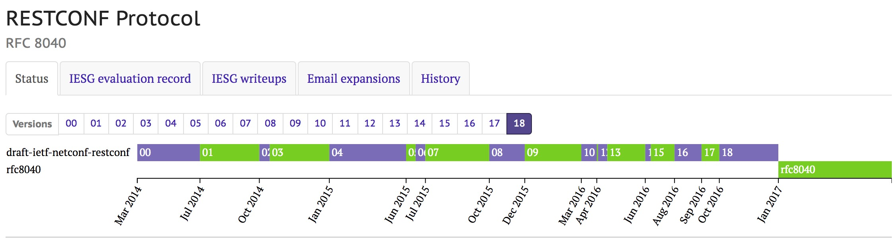

# RFC8040 (RESTCONF Protocol) 中文

## 抽象

本文档描述了一个基于`HTTP`的协议，它使用网络配置协议（`NETCONF`）中定义的数据存储概念，提供一个编程接口来访问`YANG`中定义的数据。

## 本备忘录的状态

这是一个互联网标准跟踪文件。

本文档是`Internet`工程任务组（`IETF`）的产品。它代表了`IETF`社区的共识。已经接受公众评议，并获得互联网工程指导组（`IESG`）的批准。有关`Internet`标准的更多信息，请参阅[RFC 7841](https://tools.ietf.org/html/rfc7841)的[第2节](https://tools.ietf.org/html/rfc7841#section-2)。

有关本文档当前状态的信息，所有勘误表，以及如何提供反馈意见，请访问 http://www.rfc-editor.org/info/rfc8040 。

## 版权声明

版权所有`（c）2017 IETF Trust`和被确定为文档作者的人员。版权所有。

本文档受[BCP 78]()和`IETF`信托关于`IETF`文档的法律条款（http://trustee.ietf.org/license-info）的约束，在本文档发布之日生效。请仔细阅读这些文档，因为它们描述了您对本文档的权利和限制。代码从本文档中提取的组件必须包含“信托法律条款”第4.e节所述的简化`BSD`许可证文本，并且不提供“简化`BSD`许可证”中所述的保证。
